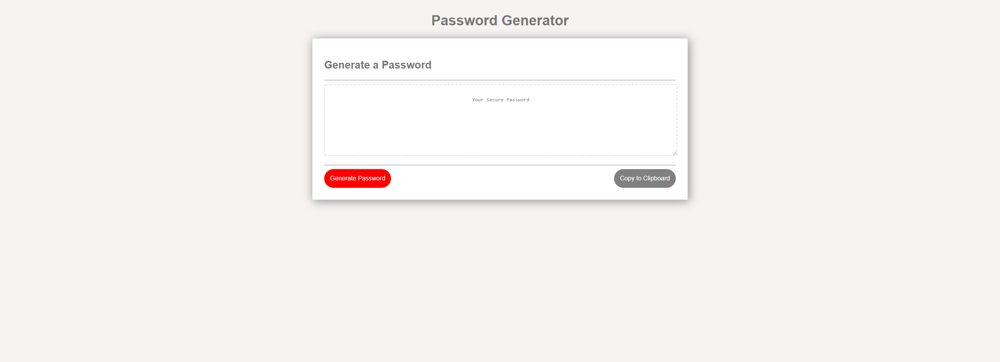
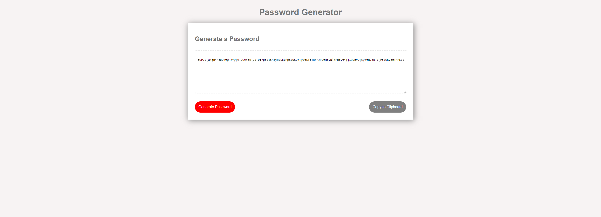

# Password Generator

## Description

This project created a password generator that helps users by creating random passwords that meet certain requirements.
The password generator creates strong passwords that provide better security for users.

## Requirements Met

The project fulfills the following requirements:
* Presents users with prompts to follow for password criteria
* Asks users for the length of the password between 8 and 128 characters
* Asks users if they want to include lowercase, uppercase, numeric, and/or special characters
* When all prompts are answered it generates a password that matches the criteria selected by the user
* The password is displayed in the alert window for the user and can also be copied to the clipboard by the user

## Links

Link to Github Repository: https://github.com/mikecota09/PasswordGenerator.git

Link to Deployed Page: https://mikecota09.github.io/PasswordGenerator/

## Screenshots

  
  
